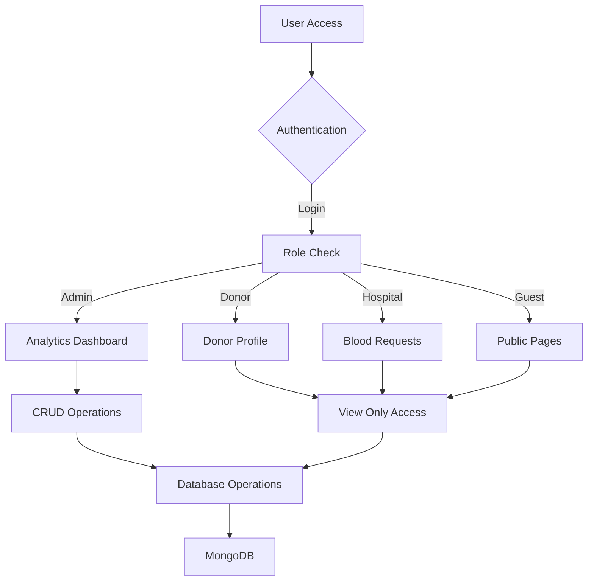

# 🩸 eRaktkosh Clone - Blood Donation Management System

> **A modern, full-stack blood donation portal built with React & Node.js**

[](http://localhost:5173/)
[](http://localhost:5001/)
[](mongodb://localhost:27017/eraktkosh)

A comprehensive React-based clone of India's eRaktkosh portal with enhanced features, modern UI/UX, and enterprise-level functionality for blood donation management.

## 🎯 **How It Works - System Architecture**

### 🔄 **Application Flow**



### 🏗️ **System Components**

#### **Frontend Architecture (React)**
```
┌─────────────────────────────────────┐
│           React Frontend            │
├─────────────────────────────────────┤
│  🎨 UI Components                   │
│  • Header/Footer                    │
│  • Login/Register Forms             │
│  • Dashboard Pages                  │
│  • Data Tables & Charts             │
├─────────────────────────────────────┤
│  🔧 Services Layer                  │
│  • API Client (Axios)              │
│  • Authentication Service          │
│  • Data Management                 │
├─────────────────────────────────────┤
│  🛡️ Security                        │
│  • Protected Routes                 │
│  • JWT Token Management            │
│  • Role-based Access Control       │
└─────────────────────────────────────┘
```

#### **Backend Architecture (Node.js)**
```
┌─────────────────────────────────────┐
│          Express Backend            │
├─────────────────────────────────────┤
│  🛣️ API Routes                      │
│  • /api/auth (Authentication)       │
│  • /api/donors (Donor Management)   │
│  • /api/bloodbanks (Blood Banks)    │
│  • /api/requests (Blood Requests)   │
├─────────────────────────────────────┤
│  🔐 Middleware                      │
│  • CORS Configuration              │
│  • JWT Verification                │
│  • Request Validation              │
├─────────────────────────────────────┤
│  💾 Data Layer                      │
│  • Mongoose ODM                    │
│  • MongoDB Connection              │
│  • Schema Validation               │
└─────────────────────────────────────┘
```

### 🔐 **Authentication Flow**

```
1. User Login Request
   ↓
2. Backend Validates Credentials
   ↓
3. Password Verification (bcrypt)
   ↓
4. JWT Token Generation
   ↓
5. Token Sent to Frontend
   ↓
6. Token Stored in localStorage
   ↓
7. Role-based Redirect
   ↓
8. Protected Route Access
```

### 📊 **Data Flow Diagram**

```
Frontend (React)     ←→     Backend (Express)     ←→     Database (MongoDB)
├─ Login Form        ←→     ├─ Auth Routes        ←→     ├─ Users Collection
├─ Donor Pages       ←→     ├─ Donor Routes       ←→     ├─ Donors Collection
├─ Blood Bank Pages  ←→     ├─ BloodBank Routes   ←→     ├─ BloodBanks Collection
└─ Request Pages     ←→     └─ Request Routes     ←→     └─ Requests Collection
```

## 🚀 **Features & Capabilities**

### 🎯 **Core Functionality**
- **🏠 Home Page**: Hero section with real-time statistics and services overview
- **🏥 Blood Banks**: Search and locate nearby blood banks with live availability
- **👤 Donor Management**: Complete registration and profile management system
- **🩸 Blood Availability**: Real-time blood stock tracking across locations
- **🚨 Emergency Requests**: Urgent blood request system with notifications
- **📊 Analytics Dashboard**: Comprehensive charts and statistics (Admin only)

### ✨ **Advanced Features**
- **🔐 Enhanced Authentication**: JWT-based login with role-based access control
- **👑 Admin Panel**: Full CRUD operations for system management
- **🔔 Notification Center**: Real-time notifications and alerts
- **📱 QR Code Generation**: Digital donor cards and request tracking
- **🎨 Modern UI**: Responsive design with maroon color scheme
- **🛡️ Protected Routes**: Role-based navigation and permissions

### 🔑 **Enhanced Login System**
- **Quick Demo Buttons**: One-click access for different roles
- **Form Validation**: Real-time validation with error messages
- **Password Security**: Show/hide toggle with secure hashing
- **Remember Me**: Persistent login functionality
- **Loading States**: Smooth UX with loading animations

## 🛠️ **Technology Stack**

### **Frontend Technologies**
| Technology | Version | Purpose |
|------------|---------|---------|
| **React** | 18.2.0 | Modern UI library with hooks |
| **React Router DOM** | 6.8.0 | Client-side routing & navigation |
| **Vite** | 4.1.0 | Fast build tool & dev server |
| **Chart.js** | 4.4.0 | Interactive data visualization |
| **Axios** | 1.5.0 | HTTP client for API calls |
| **React Toastify** | 9.1.3 | Toast notifications |
| **React QR Code** | 2.0.18 | QR code generation |
| **Leaflet** | 1.9.4 | Interactive maps |

### **Backend Technologies**
| Technology | Version | Purpose |
|------------|---------|---------|
| **Node.js** | Latest | JavaScript runtime environment |
| **Express.js** | 4.18.2 | Web application framework |
| **MongoDB** | Latest | NoSQL document database |
| **Mongoose** | 7.5.0 | MongoDB object modeling |
| **JWT** | 9.0.2 | JSON Web Token authentication |
| **bcryptjs** | 2.4.3 | Password hashing |
| **CORS** | 2.8.5 | Cross-origin resource sharing |

### **Development Tools**
- **Nodemon** - Auto-restart development server
- **ESLint** - Code linting and formatting
- **Git** - Version control system

## 🚀 **Quick Start Guide**

### **Prerequisites**
- ✅ Node.js (v14 or higher)
- ✅ MongoDB (local or cloud)
- ✅ Git
- ✅ Code editor (VS Code recommended)

### **Installation Steps**

#### **1. Clone & Setup**
```bash
# Clone the repository
git clone https://github.com/sanjana1-2/blooddonation.git
cd blooddonation

# Install frontend dependencies
npm install

# Install backend dependencies
cd server
npm install
cd ..
```

#### **2. Environment Configuration**
```bash
# Create server/.env file
cd server
cat > .env << EOF
MONGODB_URI=mongodb://localhost:27017/eraktkosh
JWT_SECRET=your_super_secret_jwt_key_here
PORT=5001
NODE_ENV=development
EOF
cd ..
```

#### **3. Database Setup**
```bash
# Seed the database with sample data
cd server
node seed.js
# Output: Database seeded successfully!
# Added 3 donors, 2 blood banks, 1 blood requests, 3 users
cd ..
```

#### **4. Start the Application**

**Option A: Manual Start (Recommended for Development)**
```bash
# Terminal 1 - Backend Server
cd server
npm run dev
# Server running on port 5001
# Connected to MongoDB

# Terminal 2 - Frontend Development Server
npm run dev
# VITE ready in 2599 ms
# Local: http://localhost:5173/
```

**Option B: Production Build**
```bash
# Build for production
npm run build

# Preview production build
npm run preview
```

### **5. Access the Application**
- 🌐 **Frontend**: http://localhost:5173/
- 🔧 **Backend API**: http://localhost:5001/
- 📊 **Database**: MongoDB running on port 27017

## 👤 **Demo Accounts & Testing**

### **🎯 Quick Demo Login**
*Use the one-click demo buttons on the login page for instant access*

| Role | Email | Password | Access Level | Dashboard |
|------|-------|----------|--------------|-----------|
| **👨‍💼 Admin** | `admin@eraktkosh.in` | `admin123` | **Full CRUD Access** | Analytics Dashboard |
| **🩸 Donor** | `donor@eraktkosh.in` | `donor123` | **View Only** | Donor Profile |
| **🏥 Hospital** | `hospital@eraktkosh.in` | `hospital123` | **View Only** | Blood Requests |

### **🔐 Authentication Features**
- **Enhanced Login Form** with real-time validation
- **Password Show/Hide Toggle** for better UX
- **Remember Me** functionality
- **Role-based Redirects** after successful login
- **JWT Token Management** with automatic expiry handling

### **🎮 Testing Scenarios**

#### **Admin Testing**
```bash
1. Login as Admin → Access Analytics Dashboard
2. View all donors, blood banks, and requests
3. Test CRUD operations (Create, Read, Update, Delete)
4. Check notification center functionality
5. Verify role-based access controls
```

#### **Donor Testing**
```bash
1. Login as Donor → Access Donor Profile
2. View personal information and QR code
3. Browse blood banks and availability
4. Submit emergency blood requests
5. Check notification preferences
```

#### **Hospital Testing**
```bash
1. Login as Hospital → Access Blood Requests
2. View all blood requests in the system
3. Check blood bank availability
4. Test emergency request functionality
5. Verify read-only access restrictions
```

## 📁 **Project Structure & Code Organization**

```
eraktkosh-clone/
├── 📁 src/                          # Frontend React Application
│   ├── 📁 components/               # Reusable UI Components
│   │   ├── 📄 Header.jsx           # Navigation header with auth
│   │   ├── 📄 Footer.jsx           # Site footer
│   │   ├── 📄 NotificationCenter.jsx # Real-time notifications
│   │   └── 📄 ProtectedRoute.jsx   # Route protection wrapper
│   ├── 📁 pages/                    # Main Application Pages
│   │   ├── 📄 Home.jsx             # Landing page with stats
│   │   ├── 📄 Login.jsx            # Enhanced login form
│   │   ├── 📄 Register.jsx         # User registration
│   │   ├── 📄 Analytics.jsx        # Admin dashboard
│   │   ├── 📄 DonorProfile.jsx     # Donor management
│   │   ├── 📄 BloodBanks.jsx       # Blood bank directory
│   │   ├── 📄 BloodRequests.jsx    # Request management
│   │   └── 📄 EmergencyRequest.jsx # Urgent requests
│   ├── 📁 services/                 # API Integration Layer
│   │   └── 📄 api.js               # Axios HTTP client
│   ├── 📁 utils/                    # Utility Functions
│   └── 📄 App.jsx                   # Main application component
├── 📁 server/                       # Backend Node.js Application
│   ├── 📁 models/                   # MongoDB Data Models
│   │   ├── 📄 User.js              # User authentication model
│   │   ├── 📄 Donor.js             # Donor profile model
│   │   ├── 📄 BloodBank.js         # Blood bank model
│   │   └── 📄 BloodRequest.js      # Blood request model
│   ├── 📁 routes/                   # Express API Routes
│   │   ├── 📄 auth.js              # Authentication endpoints
│   │   ├── 📄 donors.js            # Donor CRUD operations
│   │   ├── 📄 bloodbanks.js        # Blood bank operations
│   │   └── 📄 requests.js          # Request management
│   ├── 📄 seed.js                   # Database seeding script
│   └── 📄 server.js                 # Express server setup
├── 📄 package.json                  # Frontend dependencies
├── 📄 vite.config.js               # Vite build configuration
└── 📄 README.md                     # Project documentation
```

### **🔧 Key Files Explained**

#### **Frontend Architecture**
- **`App.jsx`** - Main router and authentication context
- **`Login.jsx`** - Enhanced login with validation and demo buttons
- **`api.js`** - Centralized API client with JWT token management
- **`ProtectedRoute.jsx`** - Route guard for authenticated users

#### **Backend Architecture**
- **`server.js`** - Express server with middleware and route mounting
- **`auth.js`** - JWT authentication and user management
- **`User.js`** - User model with password hashing and validation
- **`seed.js`** - Database initialization with sample data

## 🔑 **Detailed Feature Breakdown**

### **🔐 Authentication & Security**

#### **Enhanced Login System**
```javascript
// Key Features Implementation
✅ JWT Token Authentication
✅ Password Hashing (bcrypt)
✅ Role-based Access Control
✅ Form Validation with Real-time Feedback
✅ Password Visibility Toggle
✅ Remember Me Functionality
✅ One-click Demo Login Buttons
✅ Auto-redirect Based on User Role
```

#### **Security Measures**
- **Password Hashing**: bcrypt with salt rounds for secure storage
- **JWT Tokens**: Stateless authentication with expiration
- **Protected Routes**: Frontend and backend route protection
- **Input Validation**: Server-side validation for all inputs
- **CORS Configuration**: Secure cross-origin requests

### **👑 Admin Dashboard Capabilities**

#### **Full CRUD Operations**
| Entity | Create | Read | Update | Delete |
|--------|--------|------|--------|--------|
| **Users** | ✅ | ✅ | ✅ | ✅ |
| **Donors** | ✅ | ✅ | ✅ | ✅ |
| **Blood Banks** | ✅ | ✅ | ✅ | ✅ |
| **Blood Requests** | ✅ | ✅ | ✅ | ✅ |

#### **Analytics & Reporting**
- **📊 Interactive Charts**: Blood type distribution, donation trends
- **📈 Real-time Statistics**: Active donors, available units, pending requests
- **🗺️ Geographic Data**: Blood bank locations and coverage areas
- **📋 Export Functionality**: Data export for reporting

### **🩸 Blood Management System**

#### **Inventory Tracking**
```javascript
// Blood Type Availability
{
  "A+": 25, "A-": 8,
  "B+": 30, "B-": 5,
  "AB+": 12, "AB-": 3,
  "O+": 40, "O-": 10
}
```

#### **Request Management**
- **🚨 Emergency Requests**: Priority handling for critical cases
- **📍 Location-based Matching**: Find nearest blood banks
- **🔔 Notification System**: Real-time alerts for matches
- **📱 QR Code Integration**: Digital tracking and verification

### **👤 User Experience Features**

#### **Responsive Design**
- **📱 Mobile-first**: Optimized for all device sizes
- **🎨 Modern UI**: Clean, intuitive interface design
- **⚡ Fast Loading**: Optimized performance with Vite
- **🌙 Accessibility**: WCAG compliant design patterns

#### **Interactive Elements**
- **🔔 Toast Notifications**: Real-time feedback for user actions
- **📊 Data Visualization**: Charts and graphs for better insights
- **🗺️ Interactive Maps**: Leaflet integration for location services
- **📱 QR Code Generation**: Digital donor cards and request tracking

## 🚀 **Deployment Guide**

### **Frontend Deployment (Vercel/Netlify)**

#### **Vercel Deployment**
```bash
# Install Vercel CLI
npm i -g vercel

# Build the project
npm run build

# Deploy to Vercel
vercel --prod

# Set environment variables in Vercel dashboard
VITE_API_URL=https://your-backend-url.com/api
```

#### **Netlify Deployment**
```bash
# Build the project
npm run build

# Deploy dist/ folder to Netlify
# Set build command: npm run build
# Set publish directory: dist
```

### **Backend Deployment (Railway/Heroku)**

#### **Railway Deployment**
```bash
# Install Railway CLI
npm install -g @railway/cli

# Login and deploy
railway login
railway init
railway up

# Set environment variables
railway variables set MONGODB_URI=mongodb+srv://...
railway variables set JWT_SECRET=your_secret_key
railway variables set PORT=5001
```

#### **Heroku Deployment**
```bash
# Install Heroku CLI and login
heroku login

# Create Heroku app
heroku create your-app-name

# Set environment variables
heroku config:set MONGODB_URI=mongodb+srv://...
heroku config:set JWT_SECRET=your_secret_key

# Deploy
git push heroku main
```

### **Database Deployment (MongoDB Atlas)**

#### **Setup MongoDB Atlas**
```bash
1. Create MongoDB Atlas account
2. Create new cluster
3. Set up database user and password
4. Configure network access (IP whitelist)
5. Get connection string
6. Update MONGODB_URI in environment variables
```

### **Environment Variables**

#### **Frontend (.env)**
```bash
VITE_API_URL=http://localhost:5001/api
```

#### **Backend (.env)**
```bash
MONGODB_URI=mongodb://localhost:27017/eraktkosh
JWT_SECRET=your_super_secret_jwt_key_here
PORT=5001
NODE_ENV=production
CORS_ORIGIN=https://your-frontend-domain.com
```

## 🎯 **Presentation Highlights**

### **🚀 Key Selling Points**
- **Modern Tech Stack**: React 18 + Node.js + MongoDB
- **Enhanced Security**: JWT authentication with role-based access
- **User-Friendly Design**: Intuitive UI with one-click demo access
- **Scalable Architecture**: Modular design for easy expansion
- **Real-time Features**: Live notifications and data updates

### **💡 Technical Innovations**
- **Enhanced Login System**: Password toggle, validation, remember me
- **Quick Demo Access**: One-click role-based login buttons
- **Responsive Design**: Mobile-first approach with modern UI
- **Data Visualization**: Interactive charts and analytics
- **QR Code Integration**: Digital donor cards and tracking

### **📊 Performance Metrics**
- **Fast Loading**: Vite build tool for optimal performance
- **Secure Authentication**: bcrypt + JWT implementation
- **Database Efficiency**: MongoDB with Mongoose ODM
- **API Response Time**: Optimized Express.js routes
- **Mobile Responsive**: 100% mobile compatibility

## 🤝 **Contributing & Development**

### **Getting Started with Development**
```bash
# Fork the repository
git fork https://github.com/sanjana1-2/blooddonation.git

# Create feature branch
git checkout -b feature/amazing-feature

# Make your changes and commit
git commit -m "Add amazing feature"

# Push to your fork
git push origin feature/amazing-feature

# Create Pull Request
```

### **Development Guidelines**
- **Code Style**: Follow ESLint configuration
- **Commit Messages**: Use conventional commit format
- **Testing**: Add tests for new features
- **Documentation**: Update README for new features

### **Project Roadmap**
- [ ] **Mobile App**: React Native implementation
- [ ] **Real-time Chat**: Socket.io integration
- [ ] **Payment Gateway**: Donation processing
- [ ] **Email Notifications**: Automated email system
- [ ] **Advanced Analytics**: Machine learning insights

## 📝 **License & Legal**

This project is created for **educational purposes** and is inspired by the official eRaktkosh portal by the Ministry of Health and Family Welfare, India.

### **Disclaimer**
- This is a clone/demonstration project
- Not affiliated with the official eRaktkosh portal
- For educational and portfolio purposes only
- All data used is sample/mock data

## 🙏 **Acknowledgments**

- **Original eRaktkosh Portal** - Ministry of Health and Family Welfare, India
- **React Community** - For the amazing ecosystem
- **Node.js Community** - For backend technologies
- **MongoDB** - For database solutions
- **Open Source Contributors** - For all the libraries used

## 📞 **Contact & Support**

### **Developer Information**
- **Name**: Sanjana
- **Email**: sanjana@example.com
- **GitHub**: [@sanjana1-2](https://github.com/sanjana1-2)
- **LinkedIn**: [Connect with me](https://linkedin.com/in/sanjana)

### **Project Links**
- **🌐 Live Demo**: http://localhost:5173/
- **📚 Documentation**: This README
- **🐛 Issues**: [GitHub Issues](https://github.com/sanjana1-2/blooddonation/issues)
- **💡 Feature Requests**: [GitHub Discussions](https://github.com/sanjana1-2/blooddonation/discussions)

---

<div align="center">

**🩸 Made with ❤️ for the Blood Donation Community 🩸**

*Saving lives through technology*

[](https://github.com/sanjana1-2/blooddonation)
[](https://github.com/sanjana1-2/blooddonation)
[](https://github.com/sanjana1-2/blooddonation/issues)

</div>